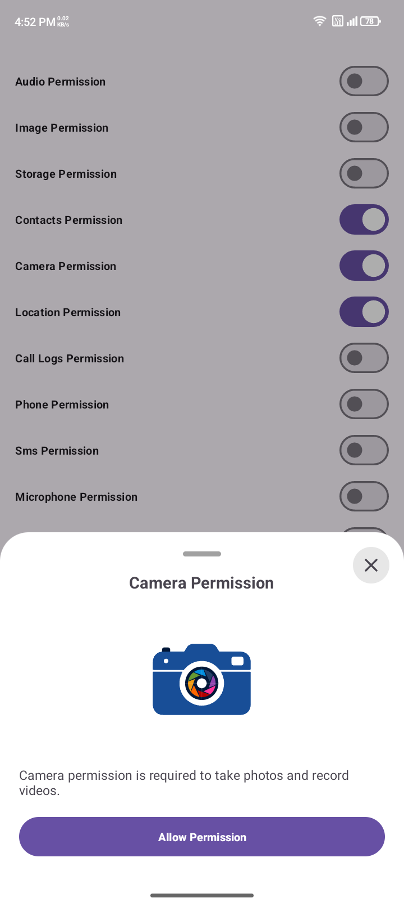
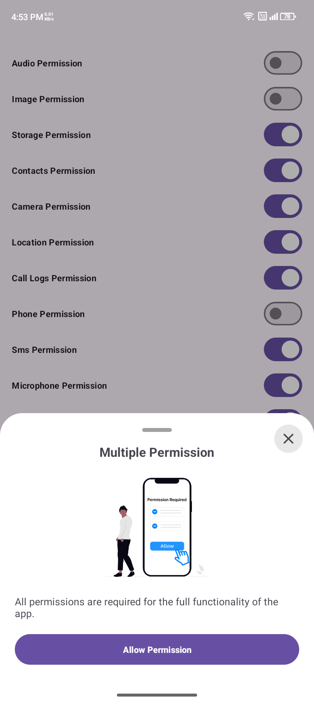
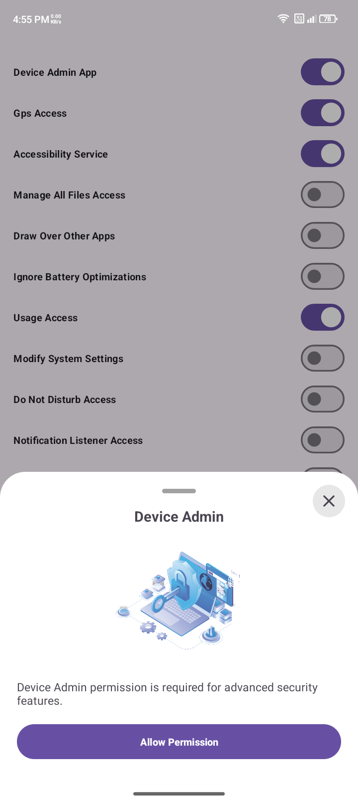

# 📌 Permissions_V2            – Android Runtime & System Permission Manager  

A powerful and easy-to-use Android library to handle both **runtime permissions** and **special/system accesses** with clean APIs and modern Material dialogs (BottomSheets).  

---

## ✨ Features  

### 🔑 Runtime Permissions  
- Camera
- Storage
- Media (Image, Audio, Video)  
- Location (Fine & Coarse)  
- Contacts
- Phone
- Call Logs  
- SMS (Send, Read, Receive)  
- Microphone / Audio Recording  
- Notifications  

### ⚙️ Special System Permissions & Access  
- Device Admin  
- Accessibility Service  
- Display over other apps (Overlay)  
- All Files Access (Manage External Storage)  
- Ignore Battery Optimization  
- Usage Access  
- Modify System Settings  
- Do Not Disturb Access  
- Install Unknown Apps  
- Notification Listener Access  
- Media Projection (Screen Capture)  
- GPS Enable  

---

## 🚀 Installation  

### LATEST-VERSION
[](https://jitpack.io/#alphatech-apps/Permissions_V2)


Add it in your `settings.gradle` at the end of repositories:
```gradle
//dependencyResolutionManagement {
//    repositoriesMode.set(RepositoriesMode.FAIL_ON_PROJECT_REPOS)
//    repositories {
//        google()
//        mavenCentral()
        maven { url 'https://jitpack.io' }
//    }
//}

```
Add on dependency via **Gradle**  `build.gradle`  (jitpack.io support):  

```gradle
dependencies {
    implementation 'com.github.alphatech-apps:Permissions_V2:Latest_version'
}
```

*(If not published yet, you can import `.aar` / `.module` locally.)*  

---

## 🛠 Usage  

### ✅ Check and Request Runtime Permissions  

```java
// Check single permission with BottomSheet Dialog -> camera 
if (!PermissionsRuntime.checkCameraPermission(this)) {
    PermissionsRuntime.requestCameraPermission(this,
        "Camera permission is required to take photos.", // BottomSheet dialog message
        true, // if you want to show BottomSheet dialog keep true, otherwise false
        getDrawable(R.drawable.image_camera) // BottomSheet dialog image
    );
}
```

```java
// Check single permission without any Dialog -> camera 
if (!PermissionsRuntime.checkCameraPermission(this)) {
    PermissionsRuntime.requestCameraPermission(this,
        "",
        true, // if you want to show BottomSheet dialog keep true, otherwise false
        null);
}
```

```java
// Request multiple permissions at once
PermissionsRuntime.requestAllPermission(
    this,
    "App needs all required permissions to work properly.",
    true,
    getDrawable(R.drawable.image_permission_multiple));
```

---

### ⚙️ Check and Request Special Access  

```java
// Check and Request Device Admin with BottomSheet Dialog 
if (!PermissionAccess.isDeviceAdminEnabled(this, MyDeviceAdminReceiver.class)) {
    PermissionAccess.requestDeviceAdminAccess(
            this,
            "", // BottomSheet dialog message
            true, // if you want to show BottomSheet dialog keep true, otherwise false
            null, // BottomSheet dialog image
            MyDeviceAdminReceiver.class);
}
```


```java
// Request GPS (Location service must be enabled)
        if (!PermissionAccess.isGPSAccessEnabled(this)) {
        PermissionAccess.requestGpsEnabledAccess(this, "", true, null, null);
}
```

```java
// Request Device Admin access
        if (!PermissionAccess.isDeviceAdminEnabled(this, MyDeviceAdminReceiver.class)) {
        PermissionAccess.requestDeviceAdminAccess(this, "", true, null, MyDeviceAdminReceiver.class);
}
```

```java
// Request Accessibility Service permission
        if (!PermissionAccess.isAccessibilityServiceEnabled(this, MyAccessibilityService.class)) {
        PermissionAccess.requestAccessibilityAccess(this, "", true, null, MyAccessibilityService.class);
}
```

```java
// Request Manage External Storage (All files access, Android 11+)
        if (Build.VERSION.SDK_INT >= Build.VERSION_CODES.R && !PermissionAccess.isManageStorageGranted(this)) {
        PermissionAccess.requestManageStorageAccess(this, "", true, null, null);
}
```

```java
// Request Overlay permission (Draw over other apps)
        if (!PermissionAccess.isSystemAlertGranted(this)) {
        PermissionAccess.requestSystemAlertAccess(this, "", true, null, null);
}
```

```java
// Request Ignore Battery Optimization (to prevent app from being killed)
        if (!PermissionAccess.isIgnoreBatteryOptimization(this)) {
        PermissionAccess.requestBatteryOptimizationAccess(this, "", true, null, null);
}
```

```java
// Request Usage Stats Access (App usage tracking permission)
        if (!PermissionAccess.isUsageStatsGranted(this)) {
        PermissionAccess.requestUsagesAccessAccess(this, "", true, null, null);
}
```

```java
// Request Modify System Settings permission
        if (!PermissionAccess.isModifySettingsGranted(this)) {
        PermissionAccess.requestModifySystemSettingsAccess(this, "", true, null, null);
}
```

```java
// Request Do Not Disturb (DND) access
        if (!PermissionAccess.isDontDistrubGranted(this)) {
        PermissionAccess.requestDontDistrubAccessAccess(this, "", true, null, null);
}
```

```java
// Request Notification Listener Service access
        if (!PermissionAccess.isNotificationListenerEnabled(this)) {
        PermissionAccess.requestNotificationListenerAccess(this, "", true, null, MyNotificationListener.class);
}
```

```java
// Request Install Unknown Apps permission (Android 8+)
        if (Build.VERSION.SDK_INT >= Build.VERSION_CODES.O && !PermissionAccess.isInstallUnknownAppsAllowed(this)) {
        PermissionAccess.requestInstallUnknownAppsAccess(this, "", true, null, null);
}

```

---

## 📂 Helpers  

- `PermissionsRuntime_helper` → Runtime permissions, codes, messages & icons  
- `PermissionAccess_helper` → System accesses (GPS, Overlay, Device Admin, etc.) with name, message, animation  
- Built-in **BottomSheet dialogs** for better UX  

---

## 🎨 UI/UX  

- Material Design BottomSheet dialogs  
- Lottie animations (`.raw` resources) for each permission  
- Customizable icons & messages  

---

## 🎥 Demo  

Here’s how it looks in action 👇  

| Camera Permission | Multiple Permissions | Device Admin Access | Device Admin Access |
|-------------------|----------------------|----------------------|----------------------|
|  |  |  |

👉 Place your GIFs or screenshots inside the `screenshots/` folder in the repo.  

---

## 🤝 Contributing  

Pull requests are welcome! If you find any bug or missing permission, open an issue or create a PR.  

---

## 📜 License  

This library is released under the **MIT License**.  
